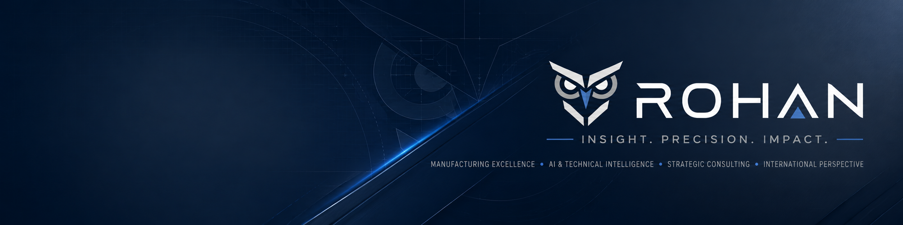

# ROHAN Digital

## AI-Powered Digital Growth for Manufacturing SMEs

ROHAN Digital helps Chinese manufacturing SMEs turn AI into practical business tools, export marketing systems, and digital assets.

We support manufacturing companies in building a more professional, searchable, and scalable presence for global business.

## What We Do

Our work focuses on:

- AI implementation for manufacturing and export workflows
- Export-ready independent websites
- SEO / GEO / AEO content systems
- Overseas digital asset building
- Technical content, product communication, and manufacturing-focused marketing
- AI-assisted workflows for translation, documentation, quotation, sourcing, and customer development

## Why It Matters

Many manufacturing SMEs have strong production capabilities, but their digital presence often fails to reflect their real value.

ROHAN Digital bridges this gap by combining manufacturing industry knowledge, export marketing logic, AI tools, and modern website architecture.

We help companies turn real capabilities into digital assets that global buyers can see, search, understand, and trust.

## Positioning

Not just website building.  
Not just content writing.  
Not just AI tools.

ROHAN Digital focuses on practical AI implementation and export-oriented digital growth systems for manufacturing SMEs.

## Website

https://rohanyang.com

[中文版本](README.zh-CN.md)
